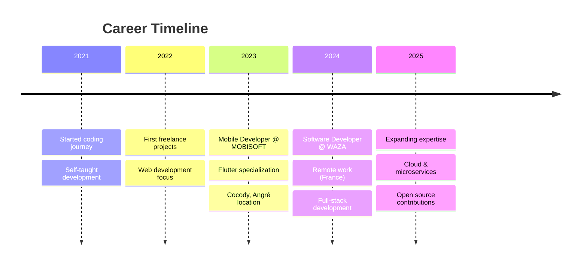

# Hey there! 👋 I'm Aristide Kamara

<div align="center">
  
</div>

<div align="center">
  
  [](https://git.io/typing-svg)
  
</div>

<div align="center">
  <a href="https://github.com/el-hack?tab=followers">
    
  </a>
  
  <a href="https://linkedin.com/in/aristide-kamara-49560921b">
    
  </a>
</div>

<br>

## 🚀 About Me


```typescript
const aristideKamara: Developer = {
  name: "Aristide Kamara",
  role: "Full Stack Web & Mobile Developer",
  location: "Abidjan, Côte d'Ivoire 🇨🇮",
  
  companies: {
    current: ["MOBISOFT", "WAZA"],
    positions: ["Mobile Developer", "Software Developer"]
  },
  
  specialties: ["Flutter", "React.js", "Node.js"],
  focus: ["Mobile Apps", "Backend APIs", "Web Development"],
  experience: "3+ years",
  
  workingOn: "Scalable mobile applications",
  learning: ["Cloud Architecture", "Microservices"],
  collaborating: "Open to mobile & web projects",
  
  motto: "Mobile-first, backend-strong 💪"
};
```

<br><br>

## 🛠️ Tech Arsenal

<div align="center">

### 📱 Mobile Development
<p>
  
</p>

### 🚀 Backend & APIs  
<p>
  
</p>

### 🌐 Frontend & Web
<p>
  
</p>

### ⚙️ DevOps & Tools
<p>
  
</p>

</div>

<br>

## 📊 GitHub Analytics

<div align="center">
  
  
</div>

<div align="center">
  
</div>

<div align="center">
  
</div>

<br>

## 🏆 GitHub Achievements

<div align="center">
  
</div>

<div align="center">

| 🦈 **Pull Shark** x3 | ⚡ **Quickdraw** | 🎯 **YOLO** |
|:---:|:---:|:---:|
| Quality contributions | Fast issue resolution | Merge without review |

</div>

<br>

## 💼 Professional Journey

<div align="center">



</div>

<br>

## 🌱 Current Focus

<table width="100%">
<tr>
<td valign="top" width="50%">

### 🔭 Working On
- **Flutter mobile apps** with advanced features
- **Node.js microservices** architecture  
- **React.js** web applications
- Performance optimization projects

</td>
<td valign="top" width="50%">

### 🌱 Learning
- **Cloud architecture** (AWS, GCP)
- **DevOps practices** & CI/CD
- **Microservices** patterns
- **Advanced Flutter** animations

</td>
</tr>
</table>

<br>

## 📈 Weekly Development Breakdown

<!--START_SECTION:waka-->
```text
Dart         ██████████████████████▓░░   42.8% 
JavaScript   ████████████████████░░░░░   35.6% 
TypeScript   █████████░░░░░░░░░░░░░░░░   12.1% 
JSON         █████░░░░░░░░░░░░░░░░░░░░    6.3% 
YAML         ██░░░░░░░░░░░░░░░░░░░░░░░    3.2%
```
<!--END_SECTION:waka-->

<br>

## 🤝 Let's Connect & Collaborate!

<div align="center">

### 📬 Reach out for exciting projects!

<p>
  <a href="https://linkedin.com/in/aristide-kamara-49560921b" target="_blank">
    
  </a>
  <a href="mailto:aristide.kamara.dev@gmail.com" target="_blank">
    
  </a>
  <a href="https://github.com/el-hack" target="_blank">
    
  </a>
  <a href="https://aristide-kamara-portfolio.dev" target="_blank">
    
  </a>
</p>

### 💬 Ask me about Flutter, Node.js, React.js, or mobile app optimization!

</div>

<br>

---

<div align="center">
  
  
  
  ### 💫 "Code is poetry written in logic"
  
  
  
</div>

<!-- Snake eating commits -->
<div align="center">
  
</div>
