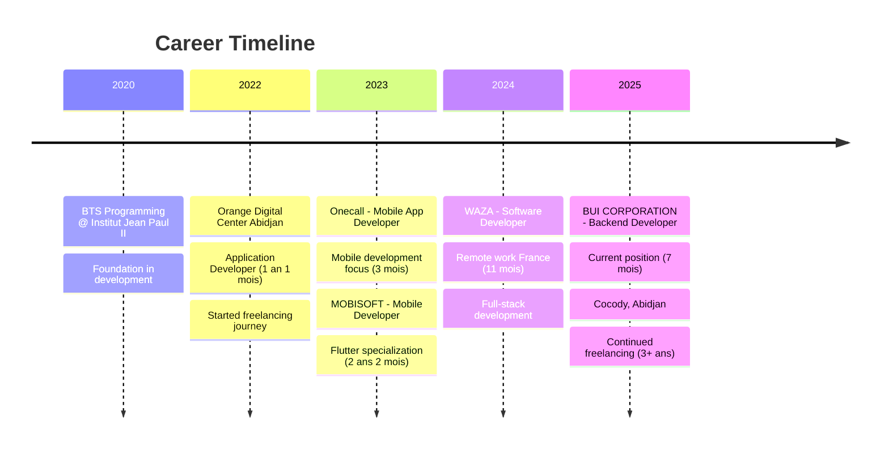

# Hey there! 👋 I'm Aristide Kamara

<div align="center">
  
</div>

<div align="center">
  
  [](https://git.io/typing-svg)
  
</div>

<div align="center">
  <a href="https://github.com/el-hack?tab=followers">
    
  </a>
  
  <a href="https://linkedin.com/in/aristide-kamara-49560921b">
    
  </a>
</div>

<br>

## 🚀 About Me


```typescript
const aristideKamara: BackendEngineer = {
  name: "Aristide Kamara",
  role: "Backend Engineer & API Architect",
  location: "Abidjan, Côte d'Ivoire 🇨🇮",
  
  companies: {
    current: ["BUI CORPORATION", "Self Employed"],
    positions: ["Backend Developer", "Freelancer"]
  },
  
  specialties: ["Node.js", "NestJS", "API Design", "System Architecture"],
  secondary: ["Flutter", "React.js", "Next.js"],
  focus: ["Backend Systems", "RESTful APIs", "Microservices", "CLI Tools"],
  experience: "4+ years",
  education: "BTS Programming (2020-2022)",
  
  projects: {
    cli: "NestGen CLI - Code generation tool",
    focus: "Scalable backend architectures"
  },
  
  workingOn: "Enterprise-grade backend systems",
  learning: ["Cloud Architecture", "DevOps", "System Design"],
  collaborating: "Open to backend & architecture projects",
  
  motto: "Backend-first, scalability-focused 🚀"
};
```

<br><br>

## 🛠️ Featured Projects

<div align="center">
  <a href="https://nestgen-cli.vercel.app/" target="_blank">
    
  </a>
</div>

### 🔥 **NestGen CLI** - Code Generation Tool
A powerful command-line interface for generating NestJS boilerplate code and project structures. Built to accelerate backend development workflow.

**🔗 [Visit NestGen CLI](https://nestgen-cli.vercel.app/)**

---

## 🛠️ Tech Arsenal

<div align="center">

### 🚀 Backend & APIs  
<p>
  
</p>

### ⚙️ DevOps & Tools
<p>
  
</p>

### 📱 Frontend & Mobile
<p>
  
</p>

</div>

<br>

## 📊 GitHub Analytics

<div align="center">
  
  
</div>

<div align="center">
  
</div>

<div align="center">
  
</div>

<br>

## 🏆 GitHub Achievements

<div align="center">
  
</div>

<div align="center">

| 🦈 **Pull Shark** x3 | ⚡ **Quickdraw** | 🎯 **YOLO** |
|:---:|:---:|:---:|
| Quality contributions | Fast issue resolution | Merge without review |

</div>

<br>

## 💼 Professional Journey

<div align="center">



</div>

<table width="100%">
<tr>
<td valign="top" width="50%">

### 🏢 **Current Positions**
**🔹 Backend Developer** @ **BUI CORPORATION**  
*février 2025 - Present*  
📍 Cocody, Abidjan, Côte d'Ivoire

**🔹 Freelancer** @ **Self Employed**  
*février 2022 - Present (3+ years)*  
📍 Remote & Local projects

</td>
<td valign="top" width="50%">

### 📈 **Recent Experience**
**🔹 Software Developer** @ **WAZA**  
*juin 2024 - avril 2025 (11 mois)*  
📍 France (Remote)

**🔹 Mobile Developer** @ **MOBISOFT**  
*mars 2023 - avril 2025 (2 ans 2 mois)*  
📍 Cocody, Angré

</td>
</tr>
</table>

### 🎓 **Previous Experience & Education**

| Poste | Entreprise | Période | Lieu |
|:------|:-----------|:--------|:-----|
| **Mobile App Developer** | Onecall | jan 2023 - mars 2023 | Abidjan, CI |
| **Application Developer** | Orange Digital Center | jan 2022 - jan 2023 | Abidjan, CI |
| **BTS Programming** | Institut Jean Paul II | jan 2020 - sep 2022 | Côte d'Ivoire |

</div>

<br>

## 🌱 Current Focus

<table width="100%">
<tr>
<td valign="top" width="50%">

### 🔭 Working On
- **Enterprise backend APIs** with Node.js & NestJS
- **Scalable system architectures** and microservices
- **NestGen CLI** - Advanced code generation tool
- **Database optimization** and performance tuning

</td>
<td valign="top" width="50%">

### 🌱 Learning
- **System Design** & Architecture patterns
- **Cloud-native** development (AWS, Docker)
- **DevOps** practices & CI/CD pipelines
- **High-performance** database strategies

</td>
</tr>
</table>

<br>

## 📈 Weekly Development Breakdown

<!--START_SECTION:waka-->
```text
TypeScript   ██████████████████████▓░░   45.8% 
JavaScript   ████████████████████░░░░░   32.4% 
Dart         █████████░░░░░░░░░░░░░░░░   15.1% 
JSON         ████░░░░░░░░░░░░░░░░░░░░░    4.2% 
YAML         ██░░░░░░░░░░░░░░░░░░░░░░░    2.5%
```
<!--END_SECTION:waka-->

<br>

## 🤝 Let's Connect & Collaborate!

<div align="center">

### 📬 Reach out for exciting projects!

<p>
  <a href="https://linkedin.com/in/aristide-kamara-49560921b" target="_blank">
    
  </a>
  <a href="mailto:aristide.kamara.dev@gmail.com" target="_blank">
    
  </a>
  <a href="https://github.com/el-hack" target="_blank">
    
  </a>
  <a href="https://aristide-kamara-portfolio.dev" target="_blank">
    
  </a>
</p>

### 💬 Ask me about Node.js, NestJS, API architecture, or system design!

</div>

<br>

---

<div align="center">
  
  
  
  ### 💫 "Code is poetry written in logic"
  
  
  
</div>

<!-- Snake eating commits -->
<div align="center">
  
</div>
